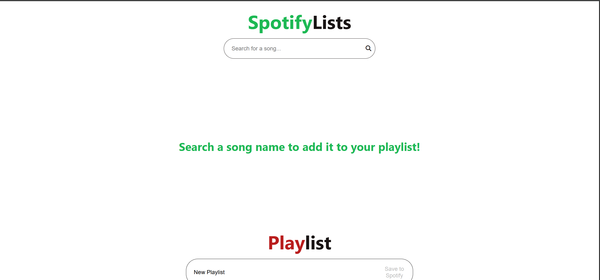
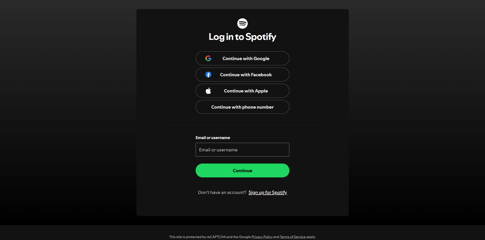
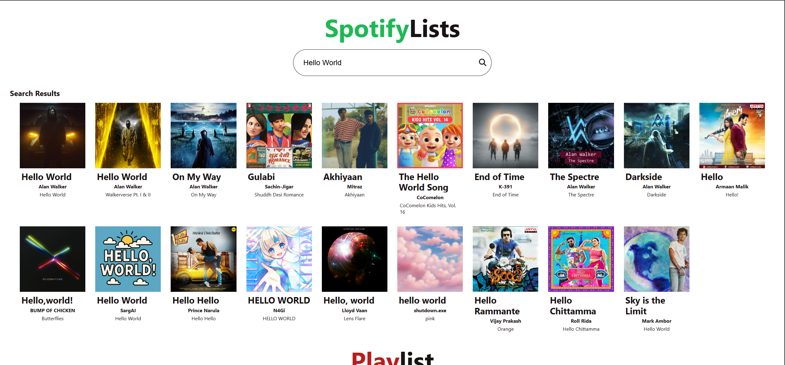
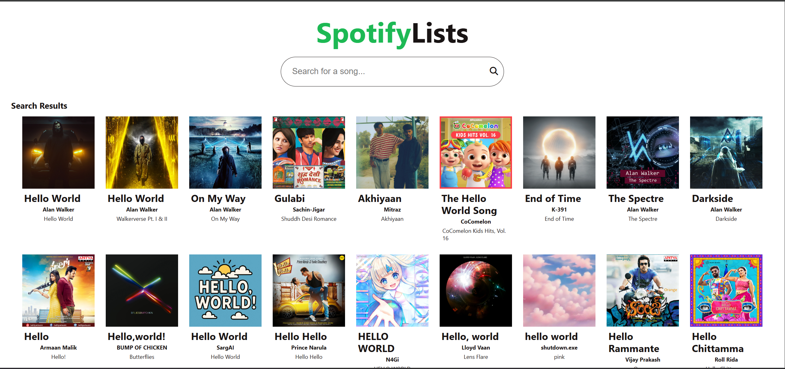
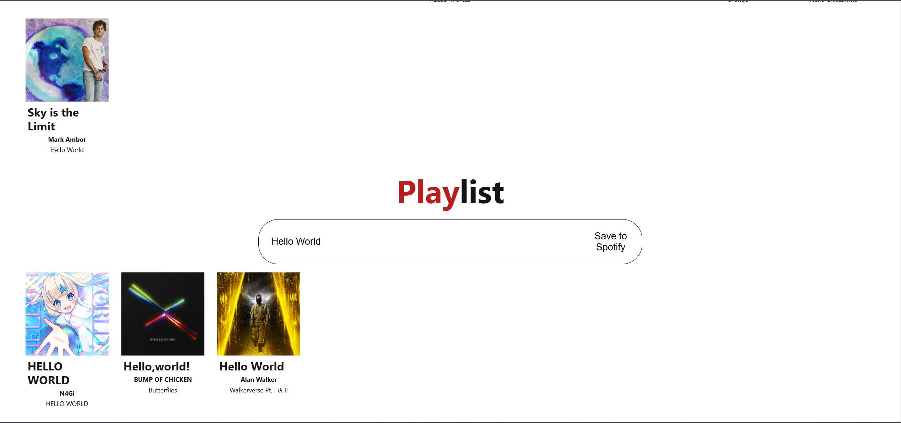

# Spotify Playlist Creator

A React web application that allows users to search for songs using the Spotify API and create custom playlists that can be saved directly to their Spotify account.

## Features

- **Spotify Authentication**: Secure user authentication through Spotify's OAuth flow
- **Song Search**: Search Spotify's vast library by song title
- **Song Details**: Display comprehensive track information including:
  - Song title
  - Artist name
  - Album name
  - Album artwork
- **Playlist Management**:
  - Add/remove tracks with a simple click
  - Custom playlist naming
  - Save playlists directly to your Spotify account

## Technologies Used

- **React**: Built using functional components and hooks
- **CSS Modules**: Modular styling approach for component-specific styles
- **Spotify Web API**: Integration for music data and playlist management
- **GitHub**: Version control and project hosting

## What I Learned

Throughout this project, I gained experience with:

- Building a multi-component React application
- Managing application state using React hooks (useState, useEffect)
- Implementing OAuth authentication flow
- Working with REST APIs and handling asynchronous operations
- Using CSS Modules for styled components
- Props management and component communication
- Version control with Git and GitHub

## Areas for Improvement

1. **API Implementation**:
   - Currently relies heavily on example code and Copilot
   - Need to better understand OAuth flows and API documentation
   - Goal: Implement API integrations from scratch in future projects

2. **Testing**:
   - Currently lacks test coverage
   - Need to implement:
     - Unit tests for components
     - Integration tests for API calls
     - End-to-end testing

## Future Enhancements

- [ ] Create shareable playlist links
- [ ] Add loading animations
- [ ] Implement comprehensive testing suite
- [ ] Mobile Compatibility

## 📱 Usage

1. Log in with your Spotify account

2. Search for songs using the search bar

3. Click on songs to add them to your playlist

4. Name your playlist

6. Click "Save to Spotify" to save your playlist
